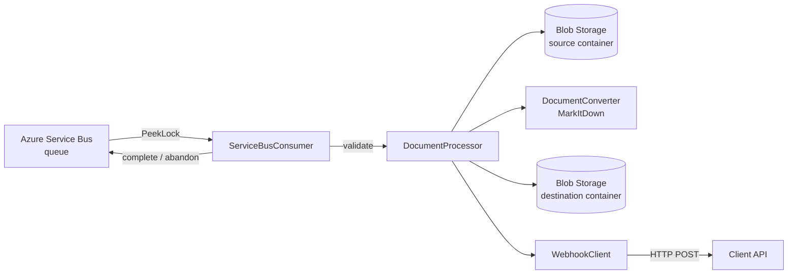

# Akay.ConvertToMarkdown

A small Python worker that converts documents (PDF, DOCX, PPTX, HTML) to
Markdown. It runs as an Azure Container App **without public ingress** and is
driven entirely by Azure Service Bus.

## Purpose

The worker performs a single, well-scoped job:

1. Receives a document conversion request from Azure Service Bus.
2. Downloads the source document from Azure Blob Storage.
3. Converts it to Markdown using [Microsoft MarkItDown](https://github.com/microsoft/markitdown).
4. Uploads the resulting Markdown to a separate Blob Storage container.
5. Notifies through an HTTP webhook.
6. Completes the Service Bus message only when processing **and** the
   corresponding webhook notification have succeeded.

The worker has **no knowledge** of domain entities. `contextId` is treated as opaque metadata.

## Architecture



- **ServiceBusConsumer** — receives, deserializes, dispatches and settles messages.
- **DocumentProcessor** — orchestrates one request; knows nothing about Service Bus settlement.
- **BlobStorage** — streaming download/upload abstraction.
- **DocumentConverter** — abstraction around MarkItDown (`MarkItDownDocumentConverter`).
- **WebhookClient** — HTTP notifications with a small local retry policy.

## Supported file types

- `.pdf`
- `.docx`
- `.pptx`
- `.html`
- `.htm`

Any other extension is rejected as `UNSUPPORTED_DOCUMENT_TYPE`.

## Local setup

Python 3.12 is required.

```bash
python -m venv .venv
.venv\Scripts\activate        # Windows
# or: source .venv/bin/activate

pip install -e ".[test]"
```

## Azure authentication

The worker uses Azure Identity with the **async**
`DefaultAzureCredential`. It never stores Storage or Service Bus connection
strings.

- In the Container App, a **User Assigned Managed Identity** is used. Set its
  client ID via `AZURE_CLIENT_ID`.
- Locally, `DefaultAzureCredential` falls back to Azure CLI developer
  credentials (`az login`).

## Required RBAC roles

The managed identity needs only the minimum permissions:

| Resource | Role |
| --- | --- |
| Service Bus queue | `Azure Service Bus Data Receiver` |
| Source Blob container/account | `Storage Blob Data Reader` |
| Destination Blob container/account | `Storage Blob Data Contributor` |

Do **not** grant Owner or Contributor.

## Environment variables

| Variable | Required | Default | Description |
| --- | --- | --- | --- |
| `AZURE_CLIENT_ID` | no | — | User Assigned Managed Identity client ID |
| `AZURE_STORAGE_ACCOUNT_URL` | yes | — | e.g. `https://<account>.blob.core.windows.net` |
| `SOURCE_CONTAINER_NAME` | yes | — | Source container name |
| `DESTINATION_CONTAINER_NAME` | yes | — | Destination container name |
| `SERVICEBUS_FULLY_QUALIFIED_NAMESPACE` | yes | — | e.g. `<ns>.servicebus.windows.net` |
| `SERVICEBUS_QUEUE_NAME` | yes | — | Queue name |
| `SERVICEBUS_MAX_LOCK_RENEWAL_SECONDS` | no | `900` | Max lock renewal duration per message |
| `WEBHOOK_CALLBACKS` | yes | — | JSON mapping of callback id → webhook URL |
| `WEBHOOK_API_KEY` | yes | — | Webhook secret (never logged) |
| `WEBHOOK_TIMEOUT_SECONDS` | no | `10` | Per-attempt HTTP timeout |
| `WEBHOOK_RETRY_COUNT` | no | `3` | Webhook attempts |
| `WEBHOOK_RETRY_DELAY_SECONDS` | no | `2` | Delay between attempts |
| `MAX_DOCUMENT_SIZE_MB` | no | `100` | Max source document size |
| `TEMP_DIRECTORY` | no | `/tmp/akay` | Ephemeral conversion data |
| `LOG_LEVEL` | no | `INFO` | Logging level |

The application **fails fast at startup** if a mandatory variable is absent.
Secrets have no default values.

## Running locally

```bash
akay-convert-to-markdown
# or
python -m akay_convert_to_markdown.main
```

## Running tests

```bash
pytest                     # unit tests
pytest --cov=akay_convert_to_markdown
```

Azure integration tests are disabled by default:

```bash
RUN_AZURE_INTEGRATION_TESTS=true pytest tests/integration
```

## Building the Docker image

```bash
docker build -t akay-convert-to-markdown .
```

The image runs as a non-root user and uses `/tmp/akay` for temporary data. No
HTTP port is exposed.

## Expected Service Bus message

```json
{
  "documentId": "47cd79ca-xxxx-xxxx-xxxx-xxxxxxxxxxxx",
  "contextId": "5af11f72-xxxx-xxxx-xxxx-xxxxxxxxxxxx",
  "userId": "e0a01a4c-xxxx-xxxx-xxxx-xxxxxxxxxxxx",
  "fileName": "tema-1.pdf",
  "sourceBlobName": "5af11f72/.../47cd79ca/.../tema-1.pdf",
  "callback": "subject-topic"
}
```

The source Blob path is taken from `sourceBlobName` and is never derived from
`fileName`.

## Output Blob structure

```text
{contextId}/{documentId}/document.md
```

The same destination Blob is overwritten when a `documentId` is reprocessed,
which contributes to idempotency.

## Webhook contracts

### Completed

The destination URL is resolved from the message's `callback` identifier via
`WEBHOOK_CALLBACKS`.

```http
POST {callback-resolved URL}
X-Akay-Webhook-Key: <secret>
Idempotency-Key: convert-to-markdown:{documentId}:completed
```

```json
{
  "eventType": "document.conversion.completed",
  "callback": "subject-topic",
  "documentId": "...",
  "contextId": "...",
  "userId": "...",
  "fileName": "tema-1.pdf",
  "output": {
    "containerName": "markdown",
    "blobName": "5af11f72.../47cd79ca.../document.md"
  }
}
```

### Failed

```http
Idempotency-Key: convert-to-markdown:{documentId}:failed
```

```json
{
  "eventType": "document.conversion.failed",
  "callback": "subject-topic",
  "documentId": "...",
  "contextId": "...",
  "userId": "...",
  "fileName": "tema-1.pdf",
  "error": {
    "code": "UNSUPPORTED_DOCUMENT_TYPE",
    "message": "Document type '.xyz' is not supported."
  }
}
```

Stack traces and internal exception details are never exposed through the
webhook; they may be written to application logs.

## Error / retry semantics

- **Permanent errors** (invalid message, unsupported extension, oversized
  document, missing source blob, corrupt document): send the
  `document.conversion.failed` webhook; complete the message only if the
  webhook returns 2xx.
- **Transient errors** (Blob/Service Bus failure, HTTP timeout, webhook
  408/429/5xx, network failure, unknown `callback`): abandon the message and let
  Service Bus redeliver it.
- The webhook has a small local retry policy (`WEBHOOK_RETRY_COUNT`,
  `WEBHOOK_RETRY_DELAY_SECONDS`) limited to transient conditions. Normal client
  errors (400/401/403/404) are not retried.
- Redelivery and dead-lettering are controlled by the queue's
  `MaxDeliveryCount`, not by application code.
- Delivery is **at-least-once**; the pipeline is idempotent.

## Logging

Structured JSON logs allow tracing a conversion by `documentId`. The webhook
API key, Azure credentials, and document/Markdown contents are never logged.

## Explicit non-goals

No domain logic, database access, RAG/chunking, OCR, LLM calls, image
extraction pipeline, HTTP API, or custom Service Bus retry scheduler.
